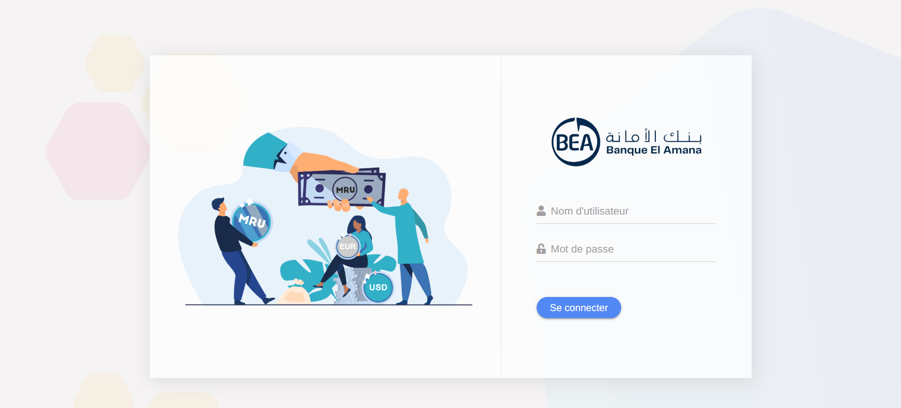
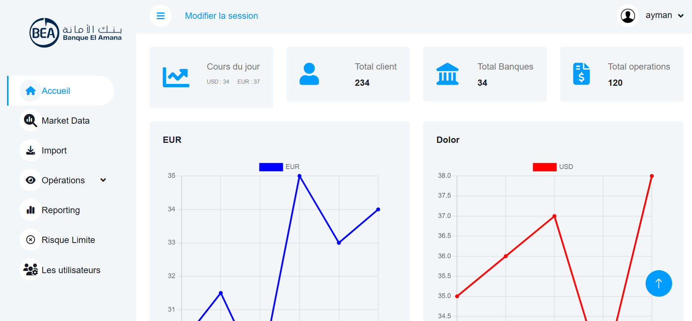

# **SalleDeMarche - Market Room Management for El Amana Bank**

  

---

## **Project Description**
**SalleDeMarche** is a web application developed with Django to streamline and optimize the management of the market room within El Amana Bank. This project focuses on monitoring financial market operations, tracking forex activities, managing transactions, and generating insightful reports.

---

## **Key Features**
- **Market Operations Management**: Add, modify, and delete financial operations.
- **Forex Tracking**: Monitor currency exchange activities.
- **Reporting**: Generate detailed reports on market status.
- **Authentication**: Secure access with a login system.
- **Intuitive Interface**: Interactive dashboard for real-time monitoring.

---

## **Screenshots**
  

---

## **Prerequisites**
Before running this project, ensure you have the following installed on your machine:
- **Python 3.8 or higher**
- **Pip** (Python package manager)
- **Git** (to clone the repository)

---

## **Installation and Project Execution**

```bash
# Clone the repository
git clone https://github.com/your-username/SalleDeMarche.git
cd SalleDeMarche

# Create a virtual environment
python -m venv venv

# Activate the virtual environment
# on Windows:
venv\Scripts\activate
# on macOS/Linux:
source venv/bin/activate

# Install dependencies
pip install -r requirements.txt

# Apply database migrations
python manage.py migrate

# Create a superuser for admin access
python manage.py createsuperuser

# Run the development server
python manage.py runserver
```

---

## **Contributing**
Contributions are welcome! Please fork the repository and submit a pull request with your improvements.

---

## **License**
This project is licensed under the MIT License.

